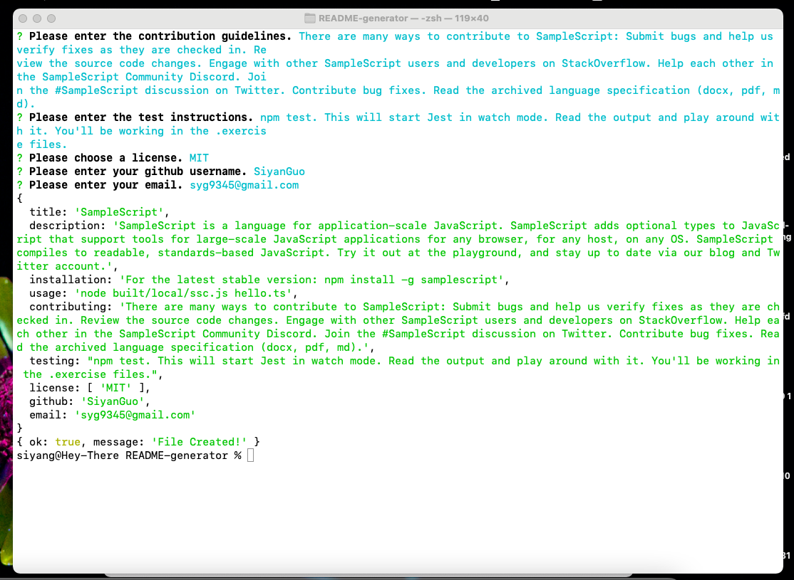

# README Generator

## Description
Users can quickly and easily generate a README file by using this command-line application. This allows the project creator to devote more time working on the project.

When the app is invoked in command-line application, users will be prompted for information about their README file, including project tile, description, ininstallation instructions, usage information, contribution guidelines, and test instructions. Questions section will be generated with user's Github username and email address. The Table of Contents will also be generated, when clicking on the links, I am taken to the corresponding section of the README. 

## Built With
* JavaScript
* Node.js
* NPM 
* Inquirer Package

## Website
A walkthrough video that demonstrates the functionality:

## Contribution
< > with ❤️  by Serena Guo

